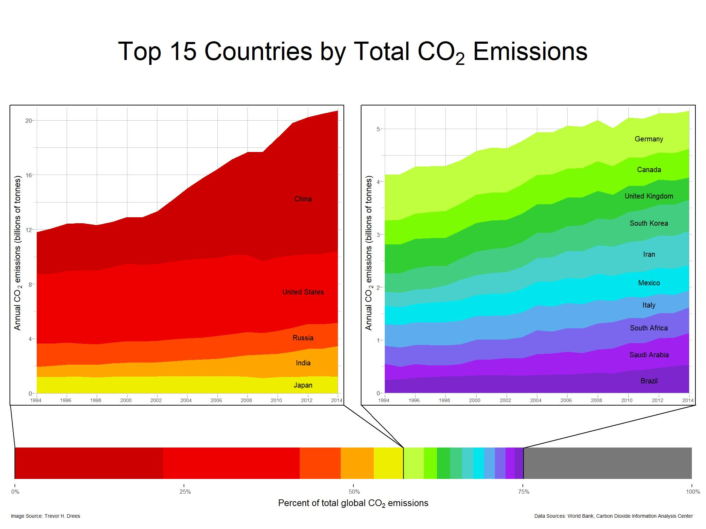

\setlength{\skip\footins}{0.35in}

```{r setup, include = FALSE}

knitr::opts_chunk$set(echo = TRUE, eval = FALSE)

```

```{r eval = TRUE, echo = FALSE, out.width = "470px", out.height = "470px", fig.pos = "!t"}



```

\bigskip
\smallskip

Here, we visualise the total CO$_{2}$ emissions for each country in the world between 1994 and 2014, which is simply calculated by summing the annual emissions for each country over the 20-year time period. Only the top 15 countries in terms of total CO$_{2}$ emissions are shown, with all other countries placed in an "other" category. Countries are ranked in descending order of total emissions; for example, even though India had more CO$_{2}$ emissions in 2014 than Russia did, Russia produced a greater amount of CO$_{2}$ over the 20-year period.

As can be seen in the graphic above, over the two decades from 1994 to 2014, almost 60% of the total CO$_{2}$ emissions originated from five countries: China, the United States, Russia, India, and Japan[^FootNote1]. When we expand this list to include the top 15 countries ranked by total CO$_{2}$ emissions, we find that these 15 countries account for almost 75% of the world's total CO$_{2}$ emissions between 1994 and 2014.

Note that the emissions shown here are expressed in absolute terms rather than on a per-capita basis, and if we consider per-capita emissions, then our order of countries changes drastically. For example, in 2014, Qatar had the highest emissions rate at 43.5 tonnes of CO$_{2}$ per capita; Saudi Arabia, the 14th country in terms of total emissions from 1994 to 2014, had the highest per-capita emissions of the 15 featured countries with a rate of 20.4 tonnes of CO$_{2}$ per capita. Though countries such as China and the United States have high have much higher total CO$_{2}$ emissions that Saudi Arabia, they actually have lower per-capita rates of 7.5 and 16.4 tonnes, respectively[^FootNote2].

[^FootNote1]: Annual CO$_{2}$ emissions data can be found at https://data.worldbank.org/indicator/EN.ATM.CO2E.KT.

[^FootNote2]: Per-capita CO$_{2}$ emissions data can be found at https://data.worldbank.org/indicator/EN.ATM.CO2E.PC.